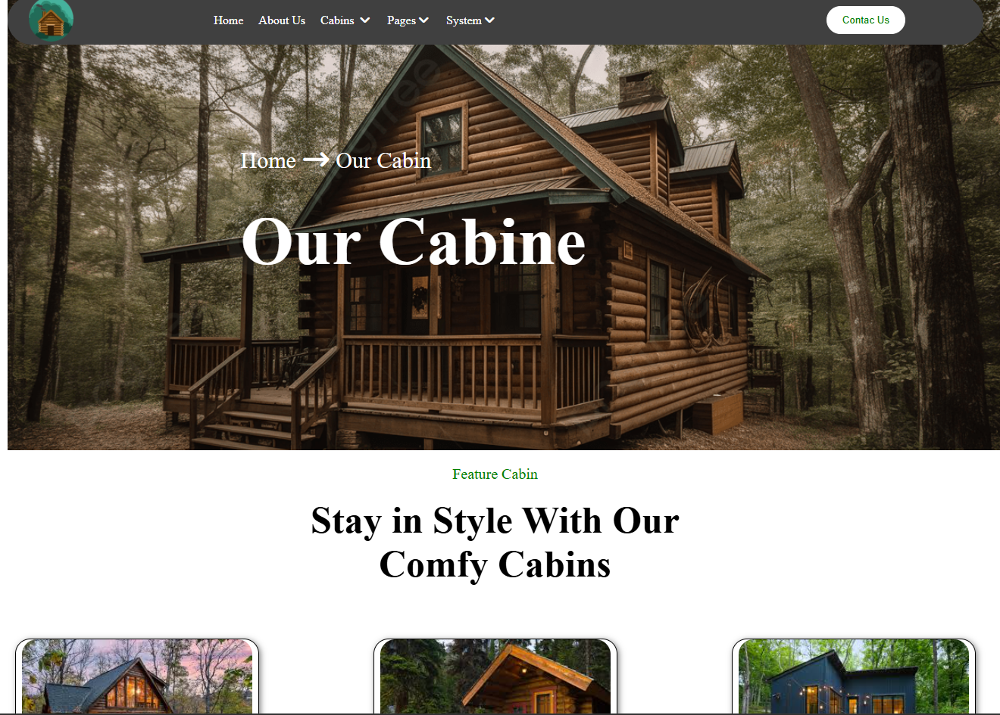

# 🏡 Cabin Booking Responsive Website

A modern and fully responsive **Cabin Booking Website** built using **HTML5** and **CSS3**. The website provides a clean and attractive interface for showcasing cabin rentals with a responsive layout that works across desktops, tablets, and mobile devices.

## ✨ Features

- 📱 Fully Responsive Design
- 🏠 Modern Cabin Listing Section
- 🧭 Responsive Navigation Bar
- 🍔 Mobile Hamburger Menu
- 💰 Cabin Pricing Display
- 🛏️ Cabin Details (Bedrooms, Wi-Fi, Area)
- 📞 Call-to-Action Booking Section
- 📌 Professional Footer
- 🎨 Clean and Modern UI
- ⚡ Cross-Browser Compatible

## 🛠️ Built With

- HTML5
- CSS3
- Font Awesome Icons
- Responsive CSS Media Queries

## 📂 Project Structure

```
Cabin-Booking-Website/
│
├── css/
│   ├── style.css
│   ├── max-width.css
│   └── all.min.css
│
├── images/
│
├── webfonts/
│
├── extra/
│
├── index.html
├── info.txt
└── README.md
```

## 🚀 Getting Started

### Clone the Repository

```bash
git clone https://github.com/tushi66/Cabin-Booking-Website.git
```

### Open the Project

```bash
cd Cabin-Booking-Website
```

Open `index.html` in your browser.

## 📸 Screenshot





## 🌐 Live Demo

https://cabin-booking-website-blue.vercel.app/

## 📋 Future Improvements

- Add JavaScript functionality
- Cabin search and filtering
- Booking form
- Login & Registration
- Backend integration
- Payment gateway
- Dark mode

## 👨‍💻 Author

**Tushar Patel**

GitHub: https://github.com/tushi66

## ⭐ Support

If you like this project, give it a ⭐ on GitHub!

---

Made with ❤️ by Tushar Patel
